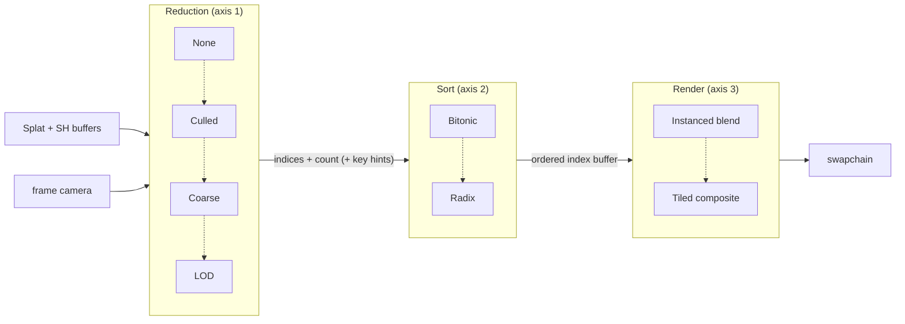

# 3D Gaussian Splatting — Ordering Strategies (design)

Design doc for a **pluggable, matrix-style ordering module** that lets Drishyam3D combine several
splat-ordering algorithms at runtime and score them head-to-head — a "sort shootout." It captures
the three-axis architecture, the backends on each axis, the measurement harness, the milestone
sequencing, and the resolved design decisions. **No code exists for this yet**; this is the plan of
record.

Companion to **[splat-rendering.md](splat-rendering.md)**, which documents the *current*
sort-then-rasterize pipeline. Read that first — this doc assumes its data model (the 64-byte
`Splat` struct, the separate SH buffer) and its bitonic sort.

> Scope note: this is **WebGPU-only**, like all splat work. The WebGL backend has no splat path.

---

## Why ordering is the interesting problem

Splats are blended, not depth-tested, so **draw order is the image**. The current renderer
re-sorts every splat by **view-space depth**, back-to-front, **every frame**
([splat-sort.wgsl](../assets/shaders/splat-sort.wgsl)) because the order changes the instant the
camera rotates. That bitonic sort is `O(N log²N)` and dominates the frame at scale — the whole
motivation for both the tile renderer and this ordering work.

### The trap: a spatial structure is not a sorted order

The intuitive idea "build a BVH/octree and sort with it" collides with one fact:

> **Depth order is view-dependent; a spatial partition is view-independent.**

A BVH/octree/grid is built once in **world space**. It cannot *be* the per-frame depth order —
you still evaluate it against the current camera each frame. So a spatial structure never drops in
as a faster *exact* sort. What it buys you is three separable things: **culling** (smaller N,
exact), **coarse ordering** (approximate, exploits frame coherence), and **LOD** (much smaller N,
merged Gaussians). Those are exactly the **Reduction** axis below.

---

## Architecture: three orthogonal axes

The core realization: "how to order" is not one choice but **three independent ones** that compose
into a matrix. Any cell of the matrix is a valid, measurable configuration.

| Axis | Options | What it decides |
|---|---|---|
| **Reduction** | None · Culled · Coarse · LOD | how the splat *set* is reduced / pre-ordered before sorting |
| **Sort** | Bitonic · Radix | the exact sort primitive over depth keys |
| **Render** | Instanced · Tiled | how the ordered splats are rasterized |

`4 × 2 × 2 = 16` combinations, each independently togglable. `None + Bitonic + Instanced` is
exactly today's renderer — the baseline the matrix is measured against.



### The composition contract

Two small interfaces, composed by the renderer:

```js
// scripts/engine/ordering/  (planned)

class ReductionStage {           // axis 1
  prepare(drawable) {}           // per-scene setup — build grid/octree/hierarchy at load
  run(frame, drawable)           // → { indexBuffer, count, keyHints? }  (subset + optional coarse rank)
}

class SortBackend {              // axis 2
  run(frame, indexBuffer, count, keyHints?)  // → ordered indexBuffer (back-to-front)
}
```

- **Reduction** produces a (possibly smaller) index set and, for `Coarse`, optional **key hints**
  (the high bits from cell rank). `None` is a passthrough (`indices[i]=i`, `count=N`).
- **Sort** orders that set by depth key, honoring any key hints. `Bitonic` and `Radix` are exact.
- The renderer (**instanced** or **tiled**) consumes the final ordered index buffer + count exactly
  as today's `draw(4, count)` reads `indices[iid]`.

On the **tiled** path the composition is the same upstream (reduction feeds the preprocess pass
fewer splats), and the Sort axis selects the tile pipeline's global `(tile, depth)` sort backend.
This is why the two families stay orthogonal: reduction changes *which* splats, sort changes *how
they're ordered*, render changes *how they're drawn*.

---

## Axis 1 — Reduction backends

### None

Passthrough: `indices[i] = i`, `count = N`. Exact. Establishes the baseline and keeps the Sort axis
usable with no spatial structure.

### Culled

Build a spatial structure over splat centers **once at load** (the scene is static — a one-time
cost seeded from `parsed.bounds` = `{center, radius}`). Per frame, a compute pass tests each node's
AABB against the view frustum and **compacts** surviving splat indices (atomic append). Output is
**exact** — culling never reorders visible splats — and `count` drops to the visible set. Highest
safe win; composes with both render modes.

> **Decision — prototype both structures.** Milestone B builds **both a uniform grid** (linear/
> Morton cell index; simple GPU build) **and a loose octree** (tighter nodes on clustered scenes),
> measures cull-throughput (survivors culled per ms) on the test scene, and keeps the winner. The
> grid doubles as the `Coarse` backend's structure regardless of the outcome.

> **Decision — indirect draw for the survivor count.** The survivor count is data-dependent and
> unknown on the CPU. The cull writes the instance count into an **indirect-args buffer** that
> `drawIndirect` consumes on-GPU — **no per-frame GPU→CPU stall**. (Counter-readback was rejected:
> it stalls the pipeline every frame.)

### Coarse (approximate)

Assign each splat to a **uniform grid cell** at load. Per frame: compute each cell's centroid depth
and sort the (few-thousand) **cells** — a tiny sort. Each splat's key becomes
`(cellRank << k) | intraDepth` (the `cellRank` is the **key hint** passed to the Sort axis). Because
cells are pre-ranked, the low bits barely matter. **Approximate**: splats near a cell boundary can
blend in the wrong order, visible as **popping** when a cell flips rank. The win comes from
**temporal coherence** — skip re-sorting cells whose relative order didn't change between frames.
This is the backend the oracle-diff exists to police.

### LOD (approximate, separate milestone)

Merge distant splats into representative Gaussians via a built hierarchy with a screen-space error
metric (Kerbl et al. 2024, *A Hierarchical 3DGS Representation*). Per frame, cut the hierarchy by
projected error and render the cut — far geometry collapses to a handful of merged splats, so `N`
drops massively on large scenes. **Weeks of work, not a toggle**: merge math, error metric, quality
tuning. It gets a matrix slot from day one but is implemented last, on its own track.

---

## Axis 2 — Sort backends

### Bitonic (the oracle)

The current sort, wrapped unchanged: `compute_keys` (key = `viewPos.z`) then `O(log²N)`
`bitonic_step` dispatches over a `nextPow2`-padded index array. Exact and deterministic — so it is
the **correctness oracle** every approximate configuration is scored against.

### Radix

4×8-bit LSD radix over the 32-bit depth key: histogram → prefix-scan → scatter, four passes. `O(N)`
work, no `log²N` blowup, no power-of-two padding waste. Exact, so `None+Radix` must be
image-identical to `None+Bitonic` — the cheapest radix correctness check. Reuses
`splat-radix-sort.wgsl` from the tile renderer, which is why it lands with **tile step 4**.

---

## Axis 3 — Render backends

Already implemented and documented in [splat-rendering.md](splat-rendering.md): **Instanced**
(billboarded quads, `SplatRenderer`) and **Tiled** (compute compositor, `SplatTileRenderer`, in
progress). This axis is unchanged by the ordering work — it just consumes the ordered index buffer.
The matrix folds the existing `setSplatRenderMode` toggle in as its third row.

---

## Measurement harness — the "which is best" part

A shootout is only useful if it scores both **speed** and **correctness**.

### Speed — GPU timestamps

Wrap each Reduction and Sort pass in a **timestamp-query** pair (feature-gated on `timestamp-query`;
CPU `performance.now()` around submit as the fallback — the same real-frame-time plumbing already in
[webgpu-scene.js](../scripts/engine/webgpu-scene.js)). Surface it in the Stats overlay as
`sort: X.X ms` (and optionally `reduce: X.X ms`). Combined with the existing fps line, toggling a
matrix cell gives a same-scene A/B instantly.

### Correctness — diff against the oracle

Bitonic-with-None is exact, so it defines "right." An **"vs oracle"** debug mode runs the candidate
configuration *and* the oracle and reports the gap:

- **Order inversions** — count adjacent pairs whose relative order disagrees with the oracle (cheap
  in-GPU reduction). Zero ⇒ exact (radix, culled); nonzero ⇒ approximate (coarse, lod).
- **Pixel diff** — reuse the offline screenshot-diff harness from the SH verification (Vite `/@fs`
  fetch → stub picker → screenshot → PIL diff over the viewport crop) for the *visible* error.

> Exact cells (any combination of None/Culled × Bitonic/Radix) must be **image-identical** to the
> oracle — any diff is a bug. Approximate cells (Coarse, LOD) trade a bounded, *measured* error for
> speed; the readout makes the trade legible instead of guesswork.

---

## UI — a matrix of radio groups

A compact **"Splat Ordering" panel** in the splat settings, three labeled radio rows (one per axis),
so any matrix cell is one click away and the current configuration is always visible:

```
┌─ Splat Ordering ───────────────────────────┐
│ Sort:      (•) Bitonic   ( ) Radix          │
│ Reduction: (•) None  ( ) Culled  ( ) Coarse │
│            ( ) LOD                          │
│ Render:    (•) Instanced   ( ) Tiled        │
└─────────────────────────────────────────────┘
Stats overlay: … + "sort: X.X ms"
```

> **Decision — matrix layout.** Three orthogonal radio groups (not a flat list, not folded into the
> render toggle), rendered either inline in the Settings dropdown or in a small dedicated popover
> panel — the widget choice is a build-time detail; the *decision* is the three-axis matrix. Unbuilt
> cells (Radix, Culled, Coarse, LOD) are disabled/"soon" until their milestone lands, so the panel
> grows in place.

---

## Milestone sequencing

"All at once" has hard dependencies (radix needs the tile shader; LOD is research). So the
**matrix framework ships first** and cells fill in as backends land:

| Milestone | Delivers | Cells live | Risk |
|---|---|---|---|
| **A** ✅ | `ReductionStage`/`SortBackend` interfaces + `None` + `Bitonic` (refactor current) + matrix UI | None×Bitonic | low — pure refactor, must match today |
| **B** ✅ | `Culled` frustum cull + indirect draw + GPU-timestamp reduce/sort timing; octree built + measured → **grid wins** (see Resolved decision 4) | + Culled×Bitonic | done — grid cull ~0.066 ms, exact |
| **C** | `Radix` — reuse tile radix shader (the real target: sort ~0.92 ms dominates) | + ×Radix column | med — shared with tile step 4 |
| **D** | `Coarse` + vs-oracle quality readout | + Coarse×* | med — approximate; popping to tune |
| **E** | `LOD` — merged-Gaussian hierarchy | + LOD×* | high — own track, weeks |

Milestone A is independently testable: with only `None×Bitonic` wired, the render must be
**byte-identical to today** — the refactor is correct iff nothing changed on screen.

---

## Planned files

```
scripts/engine/ordering/
  reduction-stage.js       NEW  axis-1 base class / contract
  none-reduction.js        NEW  passthrough (indices[i]=i)
  culled-reduction.js      NEW  (B) grid/octree frustum cull → compact → indirect args
  coarse-reduction.js      NEW  (D) grid cell rank → key hints
  lod-reduction.js         NEW  (E) hierarchy cut
  sort-backend.js          NEW  axis-2 base class / contract
  bitonic-backend.js       NEW  wraps existing compute_keys + bitonic_step
  radix-backend.js         NEW  (C) shared radix shader
  spatial/grid.js          NEW  (B) build-at-load uniform/Morton grid over centers
  spatial/octree.js        NEW  (B) build-at-load loose octree over centers
assets/shaders/
  splat-cull.wgsl          NEW  (B) frustum test + compaction + indirect args
  splat-coarse.wgsl        NEW  (D) cell depth + key composition
```

Touched: [splat-renderer.js](../scripts/engine/renderers/splat-renderer.js) (compose reduction+sort
instead of the inline sort), [splat-tile-renderer.js](../scripts/engine/renderers/splat-tile-renderer.js)
(reduction feeds preprocess), [webgpu-scene.js](../scripts/engine/webgpu-scene.js)
(`setSplatSort`/`setSplatReduction` + registries), [webgpu-facade.js](../scripts/engine/webgpu-facade.js)
(expose them), [App.jsx](../ui/src/App.jsx) (the matrix panel + the `sort: X.X ms` overlay line).

---

## Resolved decisions

1. **Three-axis matrix** (Reduction × Sort × Render), not a flat strategy list — orthogonal axes
   that compose; the UI is a matrix of radio groups.
2. **Culled structure: prototype both** a uniform/Morton grid and a loose octree in milestone B;
   measure cull-throughput; keep the winner. The grid also backs `Coarse`.
3. **Culled count: indirect draw** — cull writes instance count to an indirect-args buffer consumed
   on-GPU; no per-frame readback stall.
4. **Culled structure winner: the uniform grid** (measured, milestone B). With the B4 GPU timer on
   the 85k plant, the grid cull runs in **~0.066 ms** — negligible against the **~0.92 ms** bitonic
   sort — and is visually exact (verified: None vs Culled pixel-identical at 17% and 59% culled, no
   edge artifacts). The octree's only edge is *tighter* culling, which can shave at most a fraction
   of an already-free 0.066 ms while the sort dominates 14×. So the **GPU octree cull is not built**:
   the octree is kept as a tested build-time module ([spatial/octree.js](../scripts/engine/ordering/spatial/octree.js))
   ready for a future scene large/clustered enough to matter, and the real optimization target moves
   to the **sort** (radix, milestone C). The reduction axis exposes only `None` and `Culled`.

### Still open (deferred to their milestone)

- **Matrix widget** — inline dropdown rows vs dedicated popover panel — a milestone-A UI detail.
- **Key-hint width `k`** for `Coarse` — how many high bits the cell rank claims — tuned in D against
  the popping readout.
```
