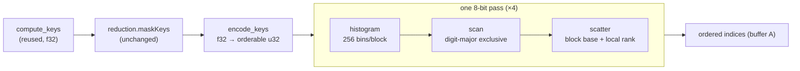

# Ordering Milestone C — GPU Radix Sort (implementation plan)

Implementation plan for the **Radix** cell of the Sort axis in
[splat-ordering.md](splat-ordering.md). That doc designs the three-axis matrix and resolves the
architecture; this one is the build order for the single milestone that matters most right now.

> **Status:** **shipped.** C0–C5 are done: radix is selectable in the matrix, exact against the
> bitonic oracle, **6–8× faster on the sort** and **~2–2.7× faster per frame** (see
> [Results](#results)). Milestones A and B
> were shipped earlier (`SortBackend`/`ReductionStage`, `None` + `Culled`, `Bitonic`,
> GPU-timestamp timing, matrix UI).

## Results

Measured on the cluster-fly ladder, scenes normalized to origin/radius-1, `None` reduction, 900×700,
via `scene.measureFrameCost()` — which renders frames back to back awaiting
`queue.onSubmittedWorkDone()`, so each frame's GPU work is drained before the next is timed:

| scene | bitonic sort | radix sort | sort | bitonic frame | radix frame | **frame** |
|---|---:|---:|---:|---:|---:|---:|
| fly M (145,617) | 6.95 ms | **0.85 ms** | 8.2× | 11.4 ms | **4.2 ms** | **2.7×** |
| fly L (301,958) | 11.01 ms | **1.84 ms** | 6.0× | 23.6 ms | **12.3 ms** | **1.9×** |
| fly XXL (3,506,799) | 83.9 ms | **12.5 ms** | 6.7× | 103.3 ms | **40.5 ms** | **2.55×** |

So radix is **6–8× faster on the sort** and **~2–2.7× faster end to end**. At XXL that is roughly
10 fps → 25 fps. The render pass is unchanged by the sort axis, as expected (15.1 ms at XXL either
way), and is what now dominates once the sort stops doing so — which is the tile renderer's case.

> **These supersede earlier figures of "12–17× on the sort".** Those were taken with the rAF loop
> free-running, where the GPU queues several frames deep and a pass's measured span stretches to
> include contention. Draining the queue per frame changes bitonic at XXL from an apparent 1027 ms
> to a true 83.9 ms. Same code, same scene — only the measurement differs, and only the drained
> numbers are load-bearing.

Exactness held everywhere it was checked: **0 px differ** against bitonic on M and L, under both
`None` and `Culled`.

> **Three measurement traps, all of which produced wrong numbers before being caught.** Recorded
> because every one of them looked plausible at the time:
> 1. **Invalid pipelines render nothing, silently.** A WGSL parse error surfaces as a console
>    *warning*, and `createComputePipeline` still returns a non-null object — so guards pass, the
>    command buffer is rejected, and the canvas keeps its last good frame. It reads as "fast and
>    correct" (high fps, small pixel diff) rather than as a failure. Always prove liveness by
>    perturbing the camera, and capture console *warnings*, not just errors.
> 2. **The old `GpuTimer` readback was single-flight and served the last successful sample forever.**
>    Measure too soon after load and you got cold-start frames; whichever backend ran first inherited
>    them. This produced both a fake 15× win and a fake pathological blowup, and on XXL it froze
>    outright — byte-identical numbers for 60 s across a backend switch. Fixed: a ring of readback
>    slots, and stale samples withheld rather than served (see gpu-timer.js).
> 3. **`fps` is the rAF callback rate and `frameMs` is CPU encode time only** — neither measures GPU
>    frame cost, and with work queued several frames deep even a timestamp span stretches. Measure
>    with `measureFrameCost()`, which drains the queue per frame.

> **The frame-time gap is resolved.** It was an artifact of the free-running loop: with the queue
> drained, `sort + render` accounts for most of the frame (XXL radix: 12.5 + 14.6 of 40.5 ms; the
> ~13 ms remainder is the untimed `compute_keys` pass plus per-frame CPU work).

---

## Why the sort, and why now

Milestone B's GPU timer on the 85k-splat test scene:

| pass | time | share |
|---|---|---|
| grid frustum cull (`Culled`) | ~0.066 ms | 1× |
| bitonic sort | ~0.92 ms | **14×** |

Culling is already free. The sort is the frame, and it is the term that scales worst: bitonic is
`O(N log²N)` over an index array padded to `nextPow2`. The padding is not a rounding detail — at
1.36M splats the array pads to 2²¹ = 2,097,152, so **35% of the sort work is on entries that do not
exist** (a 54% inflation over the real count).

Dispatch counts make the gap concrete at 1.36M splats:

| | dispatches | elements sorted | padding waste |
|---|---|---|---|
| Bitonic | **231** (`21·22/2` stages) | 2,097,152 | 35% |
| Radix (4 × 8-bit LSD) | **~21** | 1,360,000 | 0% |

Radix is also **exact**, which makes it the cheapest cell in the matrix to verify: `None+Radix` must
be image-identical to `None+Bitonic`, and the existing golden-image harness already knows how to
check that. And the shader is the one [splat-rendering.md](splat-rendering.md) earmarks for **tile
step 4** — so C unblocks the tile renderer's global `(tile, depth)` sort as a side effect.

---

## C0 — The benchmark ladder ✅

**The 85k plant cannot demonstrate this milestone.** At that size radix's fixed cost — 4 passes,
5 dispatches each, a histogram matrix to scan — will plausibly *lose* to bitonic. That is not a
failure; it is the expected shape of the curve, and it is exactly why the matrix keeps both
backends selectable. But it means shipping C without large scenes proves nothing.

No synthetic generator is needed: `assets/3dgs/cluster-fly.zip` (already local, already gitignored)
holds a real S/M/L/XL/XXL capture ladder. All five are `binary_little_endian`, SH degree 3, 59 float
properties (no normals, 236 B stride) — the parser handles them as-is. Extracted to
`assets/3dgs/cluster-fly/`:

| scene | splats | splat buf (64 B) | bitonic pads to | padding inflation | SH deg 3 (180 B) |
|---|---:|---:|---:|---:|---:|
| fly S | 25,627 | 1.6 MB | 32,768 | +27.9% | 4.6 MB |
| TRE (current) | 85,329 | 5.5 MB | 131,072 | +53.6% | 15.4 MB |
| fly M | 145,617 | 9.3 MB | 262,144 | **+80.0%** | 26.2 MB |
| fly L | 301,958 | 19.3 MB | 524,288 | +73.6% | 54.4 MB |
| fly XL | 624,180 | 40.0 MB | 1,048,576 | +68.0% | 112.4 MB |
| fly XXL | 3,506,799 | 224.4 MB | 4,194,304 | +19.6% | 631 MB |

Five usable rungs spanning **24× in N**, with real spatial distribution — so cull ratios stay
meaningful too, which a replicated scene would have destroyed. The M rung is the sweetest data
point available: at 145,617 splats bitonic pads to 262,144 and does **80% of its work on entries
that do not exist**.

> **Licensing.** Cluster fly (Pollenia) by Dany Bittel, **CC-BY 4.0** — attribution required on any
> published screenshot or benchmark writeup: [www.danybittel.ch](https://www.danybittel.ch). The
> `.ply` files stay gitignored under `assets/3dgs/` like every other local capture.

> **XXL was the ceiling test, and the ceiling has since been removed.** Its 224.4 MB splat buffer
> exceeds the 134.2 MB *default* binding limit, so it failed to load until the device started
> requesting the adapter's real limits (2048 MB on the test machine). It now loads in ~10 s at SH
> degree 3 and is a full rung of the ladder.

> **SH degree does not affect the `sort` span.** The sort reads only `posPad.xyz` from the 64-byte
> struct; SH lives in a separate buffer touched only by the render pass. With the raised limits the
> whole ladder runs at degree 3 — but hold the degree fixed across rungs anyway when comparing
> *frame* time.

A synthetic replicator (translation-only lattice, leaving `rot_*` and `f_rest_*` valid) is worth
building **only** if the 624k → 2.09M gap turns out to matter. Defer it until the ladder says so.

### The ceiling the ladder exposed (fixed)

`requestDevice` used to pass no `requiredLimits` ([webgpu-helpers.js:32](../scripts/engine/webgpu-helpers.js#L32)),
so the device took the **default 128 MiB `maxStorageBufferBindingSize`** regardless of adapter
capability. At 64 B/splat that capped the splat buffer at **2,097,152 splats**, which is why fly XXL
(3.5M splats, 214 MiB) would not load on an adapter reporting 2048 MiB — roughly 10x the headroom it
was denied. It read as "this machine cannot handle 3M splats"; it was a limit never requested.

Both halves are now fixed: the device requests the adapter's reported limits, and
`createSplatStorageBuffer` is size-checked first so an genuinely oversized cloud reports how much it
needed instead of failing as a bare validation error.

---

## C1 — `assets/shaders/splat-radix-sort.wgsl`

### The key-encoding trap

The existing key buffer is `array<f32>` holding raw view-space `z`
([splat-sort.wgsl:37](../assets/shaders/splat-sort.wgsl#L37)), and **`splat-cull.wgsl` writes into
that same buffer** — `apply_cull` sinks culled splats with `FAR_KEY = 3.0e38`
([splat-cull.wgsl:84](../assets/shaders/splat-cull.wgsl#L84)).

Radix needs unsigned integer keys. The wrong move is to change the key buffer's type, because that
breaks the `maskKeys` composition contract and drags `CulledReduction` into the change.

**The right move: keep the f32 key buffer as the shared contract and encode into a private u32
buffer.** IEEE-754 f32 has an order-preserving map into u32:

```wgsl
fn orderable(f : f32) -> u32 {
    let u = bitcast<u32>(f);
    // Negatives: invert everything (reverses their reversed order).
    // Positives: flip only the sign bit (lifts them above all negatives).
    let mask = select(0x80000000u, 0xFFFFFFFFu, (u & 0x80000000u) != 0u);
    return u ^ mask;
}
```

Ascending u32 order then equals ascending f32 order — which is exactly the back-to-front order the
renderer needs. `FAR_KEY` is a large positive float, so it maps near `0xFFFFFFFF` and **culled and
tail-padding entries still sink to the end for free**. `splat-cull.wgsl` and `culled-reduction.js`
are untouched, and `Culled+Radix` composes with no extra work.

Get the negative branch wrong and the bug is nasty: the scene renders correctly from angles where
all depths share a sign, and inverts only where the camera straddles the origin.

### Pass structure — reduce-then-scan, 4 × 8-bit LSD



- **Block = 4096 elements** (256 threads × 16 items). This is the load-bearing choice: it keeps the
  histogram matrix small enough for a simple two-level scan. At 1.36M splats that is 333 blocks →
  a 256 × 333 matrix = 85,248 u32 = 341 KB, scanned as 21 workgroups → 1 workgroup of sums →
  uniform add. Smaller blocks would force a general multi-level scan for no gain.
- **Scan is digit-major** (all blocks of digit 0, then digit 1, …) so one exclusive scan yields
  every `(digit, block)` its global base offset.
- **Scatter destination** = `blockBase[digit][block] + rank within block`, where the local rank
  comes from a workgroup-shared counting scan — *not* from atomics, which would make the sort
  unstable and non-deterministic frame to frame.
- **All dispatches go in a single `beginComputePass`.** WebGPU orders dispatches within a pass and
  synchronises storage writes between them, so no explicit barriers are needed — and it means the
  whole radix wears the existing `frame.gpuTimer.span('sort')` bracket, making the number directly
  comparable to bitonic's.

> **De-risking option if the scan fights back:** land a naive variant first (global-atomic
> histogram, single-workgroup scan, atomic-bump scatter). It is slower and unstable on ties, but it
> is correct on distinct keys and isolates whether a bug is in the *encoding* or in the *scan*.
> Only worth reaching for if C3 passes and the GPU still disagrees.

---

## C2 — `scripts/engine/ordering/radix-backend.js`

Implements the existing `SortBackend` contract verbatim — `prepare(drawable)`, `run(frame,
drawable, reduction)`, `get indexBuffer()`, `releaseDrawable()`, `destroy()` — so it drops into
[splat-renderer.js:167](../scripts/engine/renderers/splat-renderer.js#L167) with **zero renderer
change**. `run()` mirrors [bitonic-backend.js](../scripts/engine/ordering/bitonic-backend.js)'s
structure exactly, including the `maskKeys` hook in the same position between keys and sort.

Three details that decide whether this works:

1. **Reuse `compute_keys` unchanged.** It writes f32 keys and seeds `indices[i] = i` — precisely
   what radix needs. The backend owns its own `KeysParams` buffer and sets
   `padded = alignUp(count, 4096)` instead of `nextPow2(count)`, so tail entries get `FAR_KEY` and
   sink. `createSortBuffers` currently hardcodes `nextPow2` sizing
   ([splat-helpers.js](../scripts/engine/splat-helpers.js)) and needs parameterising, not
   replacing — bitonic still wants `nextPow2`.

2. **Ping-pong parity is a correctness invariant, not a detail.** The render bind group binds
   `sortBackend.indexBuffer` once at `prepare()` time
   ([splat-renderer.js:114](../scripts/engine/renderers/splat-renderer.js#L114)). Four passes
   scattering A→B→A→B→A is even, so the result lands back in **buffer A** and the bind group stays
   valid. That means **all four passes must always run** — no early-out on a degenerate histogram
   (a common radix optimisation), or the result silently ends up in the buffer nobody is reading.
   Either keep the pass count fixed or copy back; do not leave it implicit.

3. **Memory.** At 1.36M: key ping-pong 2 × 5.4 MB + index ping-pong 2 × 5.4 MB + histogram 341 KB
   ≈ 22 MB. Comfortable, and notably *less* than bitonic's padded arrays at the same N.

---

## C3 — CPU reference + tests ✅

Landed as [ordering/radix-reference.js](../scripts/engine/ordering/radix-reference.js) (the plain-JS
oracle the WGSL mirrors, same pattern as `spatial/frustum.js` ↔ `splat-cull.wgsl`) and
[__tests__/radix-sort.test.js](../__tests__/radix-sort.test.js) — 22 tests, all passing. The
algorithm is now fixed in JS, so a GPU disagreement in C1 localises to the shader rather than to the
design.

| test group | asserts |
|---|---|
| `orderableFromFloat` | strict monotonicity over negatives/positives/±0/f32 denormals/`FAR_KEY`, plus a 5000-value fuzz; round-trips; `FAR_KEY` outranks every plausible depth key |
| histogram + digit-major scan | hand-verified 8-key/2-block fixture: counts land in `hist[digit·blocks + block]`, and one exclusive scan yields every `(digit, block)` its global base |
| scatter | destination = base + in-block rank, stable within each digit |
| full 4-pass sort | matches a stable ascending reference for random mixed-sign, all-negative, all-equal, tied, non-block-multiple, and production-block-size inputs; output is a permutation |
| culled composition | `FAR_KEY` entries (as `apply_cull` writes them) all sort past the visible set |

Two findings worth carrying into C1:

- **±0 are not interchangeable under the map.** `−0 → 0x7FFFFFFF`, `+0 → 0x80000000`, so −0 sorts
  just before +0 even though they compare equal as floats. Deterministic and harmless for depth
  keys, but it means the encode is not 1:1 with float equality — do not "simplify" it away.
- **The `FAR_KEY` sentinel must be compared in f32 space.** `3.0e38` is an f64 literal that rounds
  when stored, so a JS-side `=== FAR_KEY` check fails against a readback. Moot inside WGSL (f32
  throughout), live for any host-side verification code — including C5's diff tooling.

---

## C4 — Wire the Sort axis ✅

Currently the reduction axis is switchable but the sort axis is hardcoded
([splat-renderer.js:49](../scripts/engine/renderers/splat-renderer.js#L49)) and Radix is greyed out
in the UI ([App.jsx:761](../ui/src/App.jsx#L761)). Symmetric to the existing `setSplatReduction`
path:

- `SplatRenderer.setSort(mode)` — swap `this.sortBackend`, then re-run `prepare()` on the current
  drawable, since the render bind group holds the *old* backend's index buffer. **This is the
  likeliest wiring bug in C4** — the reduction axis needs no rebuild, so there is no precedent to
  copy.
- `setSplatSort` in [webgpu-scene.js](../scripts/engine/webgpu-scene.js) and passthrough in
  [webgpu-facade.js](../scripts/engine/webgpu-facade.js).
- Drop the `soon: true` flag on the Radix option; the `sort` timer span needs no change.

---

## C5 — Verify, then record ✅

**Correctness.** Radix is exact, so the gate is pixel equality against the oracle. Add `*-radix`
mirrors of the existing cases to [visual/cases.mjs](../visual/cases.mjs) — the file already carries
`reduction` per case, so it needs a `sort` field:

```
front-sh3-none-radix     ≡ front-sh3-none
threeq-sh3-none-radix    ≡ threeq-sh3-none
threeq-sh3-culled-radix  ≡ threeq-sh3-culled   ← proves Culled+Radix composes
```

> **One honest caveat.** "Image-identical" holds up to **exact ties** in the 32-bit depth key.
> Alpha-over is not commutative, and neither sort is stable *relative to the other* — radix will be
> internally stable (C3), bitonic is not. Distinct splat positions make exact key ties rare, but
> duplicated or axis-aligned splats can produce them. If a case diffs, count tied keys before
> assuming a bug; a handful of isolated pixels at tie sites is expected, a coherent region is not.

**Speed.** Sweep `{85k, 340k, 1.36M} × {bitonic, radix}` from the `sort` overlay line and publish
the crossover. The expected shape — radix losing at 85k, winning decisively at 1.36M — is the
result, not a disappointment; it is the argument for keeping both cells live.

**Record** in [splat-ordering.md](splat-ordering.md): flip the milestone C row to ✅ and add a
resolved decision with the measured crossover, matching how decision 4 recorded the grid-vs-octree
outcome.

---

## Files

```
scripts/engine/ordering/radix-reference.js       ✅   (C3) plain-JS oracle the WGSL mirrors
__tests__/radix-sort.test.js                     ✅   (C3) 22 tests over the oracle
assets/shaders/splat-radix-sort.wgsl             ✅   (C1) encode + histogram/scan/scatter
scripts/engine/ordering/radix-backend.js         ✅   (C2) SortBackend impl
```

C0 needed no new code — the ladder was already in `assets/3dgs/cluster-fly.zip`, now extracted to
`assets/3dgs/cluster-fly/` (gitignored).

Touched: [splat-helpers.js](../scripts/engine/splat-helpers.js) (parameterise `createSortBuffers`
padding), [splat-renderer.js](../scripts/engine/renderers/splat-renderer.js) (`setSort` + re-prepare),
[webgpu-scene.js](../scripts/engine/webgpu-scene.js) + [webgpu-facade.js](../scripts/engine/webgpu-facade.js)
(`setSplatSort`), [App.jsx](../ui/src/App.jsx) (un-grey Radix),
[visual/cases.mjs](../visual/cases.mjs) (radix cases), [splat-ordering.md](splat-ordering.md) (record).

Deliberately untouched: `splat-cull.wgsl`, `culled-reduction.js`, `splat-sort.wgsl`. If C ends up
editing any of them, the key-encoding decision has been abandoned somewhere — worth stopping to
check why.

---

## What C reveals → follow-ups

1. **The ~2.09M splat ceiling** (C0). Two separate items: *(a)* guard `createSplatStorageBuffer`
   against `maxStorageBufferBindingSize` so oversized scenes degrade with a message instead of a
   validation error; *(b)* request a raised `maxStorageBufferBindingSize` in
   `requestDevice({ requiredLimits })` where the adapter reports headroom. Past that, chunked splat
   buffers — a genuine design change, not a patch.
2. **Tile step 4 is unblocked.** The same shader sorts `(tileId << depthBits) | quantizedDepth`
   keys; only the key composition differs. Tile steps 2–5 become the natural next track.
3. **Milestone D (`Coarse`) gets cheaper.** Its cell-rank key hint occupies the high bits of the
   same u32 key radix already sorts — the encoding built in C1 is the slot it plugs into.
