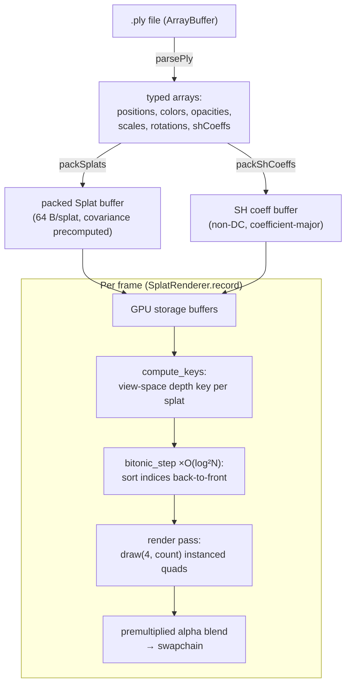

# 3D Gaussian Splatting — Rendering Implementation

Developer reference for how Drishyam3D renders 3D Gaussian Splatting (3DGS) scenes on the
WebGPU backend. Covers the current pipeline, data model, math, and public API, then a
**[What's next](#whats-next)** section describing the planned compute tile renderer.

> Splatting is **WebGPU-only**. The WebGL backend has no splat path — `loadSplats` is absent
> and the UI greys out the action under WebGL.

---

## Pipeline overview

The current renderer is **sort-then-rasterize**: every frame, a compute pass sorts all splats
back-to-front by view depth, then a raster pass draws each splat as an instanced billboard quad
with hardware premultiplied-alpha blending.

The **data → GPU boundary** is deliberate: [ply-loader.js](../scripts/engine/ply-loader.js) and
`packSplats`/`packShCoeffs` in [splat-helpers.js](../scripts/engine/splat-helpers.js) are pure
(no GPU), which keeps them unit-testable and is the seam a future WASM loader could replace.

### Per-frame passes

1. **`compute_keys`** — writes a view-space depth key per splat and seeds `indices[i] = i`.
2. **`bitonic_step`** (×O(log²N) dispatches) — compare-exchange stages that sort the index array
   back-to-front. The `(k, j)` stage schedule is camera-independent and precomputed.
3. **Render pass** — `draw(4, count)`: a 4-vertex triangle-strip quad per splat *instance*. The
   vertex shader projects the splat to a screen-space ellipse and expands the quad to cover it;
   the fragment shader evaluates the Gaussian falloff and outputs premultiplied color. Depth test
   is **off** — ordering comes entirely from the sort.

A **debug "points" mode** bypasses the sort/blend entirely and draws one point per splat center,
for validating parsing and projection in isolation.

---

## Data model

### Parsed arrays (`parsePly`)

A standard 3DGS `.ply` stores per Gaussian: position, `f_dc_*` (SH degree-0 color), optional
`f_rest_*` (higher SH), `opacity` (logit), `scale_*` (log), and `rot_*` (quaternion).
`parsePly` applies the activations on load — `sigmoid(opacity)`, `exp(scale)`, normalized
quaternion, color `= 0.5 + SH_C0·f_dc` — and **flips Y** (`y → -y`) to match the engine's
coordinate convention.

### Packed `Splat` buffer (64 bytes/splat)

`packSplats` interleaves each splat into 16 floats and **precomputes the 3D covariance**
`Σ = R·S·Sᵀ·Rᵀ` (upper triangle) so the vertex shader only projects it, never rebuilds it:

| floats | field | notes |
|--------|-------|-------|
| `[0..2]` | position xyz | `[3]` pad |
| `[4..6]` | color rgb | `[7]` opacity |
| `[8..10]` | covariance σxx, σxy, σxz | `[11]` pad |
| `[12..14]` | covariance σyy, σyz, σzz | `[15]` pad |

The 64-byte stride is intentional: the **sort only reads position**, so keeping the struct small
keeps the sort cache-friendly.

### SH coefficient buffer (separate)

Non-DC SH lives in its **own** storage buffer, kept out of the 64-byte struct so the depth sort
stays lean. Two distinct numbers govern it — conflating them is a real bug (see
[Spherical harmonics](#spherical-harmonics-view-dependent-color)):

- **stride** (`shCoeffCount(fileDegree)`) — coefficients per splat actually *stored*, fixed by
  the file. Degree 3 = 15 per channel.
- **display degree** (`shDegree`) — how many the shader *evaluates*, clamped by the UI.

`fitShDegree` degrades the stored degree if the buffer would exceed
`maxStorageBufferBindingSize` (degree 3 = 180 B/splat, so scenes past ~745k splats step down on
a 128 MB limit). File data is channel-major (`f_rest_0..14`=R, `15..29`=G, `30..44`=B) and
re-interleaved to **coefficient-major rgb triples** so the shader reads one vec3 per coefficient.

---

## Math

### EWA projection (`vs_main`)

Each splat's 3D covariance is projected to a screen-space 2D **conic** via the EWA splatting
approximation:

1. Transform the center to view space; reject if behind the camera (`w ≤ 0`).
2. Build the perspective **Jacobian** `J` at the center (pixel focal lengths from the projection
   matrix diagonal).
3. `T = W·J` where `W` is the view rotation (upper-left 3×3, transposed).
4. `Σ₂ᴅ = Tᵀ·Σ₃ᴅ·T` — the 2×2 screen covariance.
5. Add a **low-pass AA filter** (`+0.1` on the diagonal) so sub-pixel splats stay visible without
   over-blurring.
6. Eigen-decompose `Σ₂ᴅ` into major/minor axes (clamped to 512 px) to size the billboard quad.

### Gaussian falloff (`fs_main`)

The quad corners span `[-2, 2]` (≈2σ). The fragment evaluates `exp(-dot(local, local))` × opacity,
discards below ~1/255, and returns **premultiplied** `(rgb·α, α)` — matching the blend state
`src = one, dst = one-minus-src-alpha`.

### Spherical harmonics (view-dependent color)

`evalSh` in [splat.wgsl](../assets/shaders/splat.wgsl) evaluates real-SH degrees 1–3 against the
normalized view direction `normalize(center − camPos)` and adds the result to the DC color,
clamped to non-negative (per 3DGS). The offset into the SH buffer uses **`shStride`** (the stored
count), while the number of terms evaluated uses **`shDegree`** (the display count).

> **Two correctness traps, both load-bearing:**
> 1. **Y-flip sign correction.** `parsePly` mirrors the scene about Y, but SH coefficients are fit
>    in the original space. Basis functions odd in y must have their coefficients negated —
>    per-channel indices `{0, 3, 4, 8, 9, 10}` — or colors shade wrong as the camera orbits.
> 2. **Stride vs degree.** The buffer is packed at the *file's* degree; the UI can clamp the
>    *displayed* degree. Deriving the buffer offset from the displayed degree misaligns every read
>    and renders garbage at degrees 1–2 while degree 3 still looks correct (there the two numbers
>    coincide). Keep `shStride` and `shDegree` separate.
>
> Neither is catchable by unit tests alone — the second was found only by diffing rendered frames
> and checking that each degree converges monotonically toward full-quality degree 3.

---

## Sorting

The depth sort is a **bitonic sort** implemented as compute passes in
[splat-sort.wgsl](../assets/shaders/splat-sort.wgsl):

- **`compute_keys`** — `key = viewPos.z` (negative in front). Ascending sort ⇒ most-negative
  (farthest) first ⇒ correct back-to-front draw order. Padding entries (up to the next power of
  two) get `key = 3e38` so they sink past the real count and are never drawn.
- **`bitonic_step`** — one compare-exchange stage. The host dispatches O(log²N) stages; each
  stage's `(k, j)` pair is camera-independent and precomputed into a step-uniform buffer
  ([splat-renderer.js](../scripts/engine/renderers/splat-renderer.js) `_stages`).

**Cost profile:** bitonic is **O(N log²N)** work over O(log²N) dispatches, with the index array
padded to the next power of two (`nextPow2`). It's simple and self-contained but dominates the
frame at scale — the primary motivation for the tile renderer's radix sort below.

---

## File map + public API

| File | Role |
|------|------|
| [ply-loader.js](../scripts/engine/ply-loader.js) | Pure binary `.ply` parser → typed arrays, activations, SH, Y-flip |
| [splat-helpers.js](../scripts/engine/splat-helpers.js) | Pure packing (`packSplats`, `packShCoeffs`, `fitShDegree`) + GPU resource/pipeline builders |
| [renderers/splat-renderer.js](../scripts/engine/renderers/splat-renderer.js) | `SplatRenderer` — owns sort + blend pipelines, bind groups, per-frame record |
| [assets/shaders/splat.wgsl](../assets/shaders/splat.wgsl) | EWA projection + Gaussian falloff + SH eval; debug-points entry points |
| [assets/shaders/splat-sort.wgsl](../assets/shaders/splat-sort.wgsl) | Bitonic depth sort (`compute_keys`, `bitonic_step`) |
| [webgpu-facade.js](../scripts/engine/webgpu-facade.js) | `loadSplats`, `setSplatDebugMode`, `setSplatShDegree`, `getStats` |
| [webgpu-scene.js](../scripts/engine/webgpu-scene.js) | Renderer registry, per-frame `frame` object, RAF loop |

### Facade API

- **`loadSplats(arrayBuffer)`** → parses, packs, negotiates SH degree against device limits,
  creates the storage + SH buffers, and loads the splat drawable. Returns
  `{ kind:'splat', storageBuffer, shBuffer, shDegree, count, bounds }`.
- **`setSplatDebugMode('off' | 'points')`** → toggles the debug points view.
- **`setSplatShDegree(0..3)`** → clamps the evaluated SH degree (0 = flat DC color) for A/B'ing
  view-dependent shading.
- **`getStats()`** → `{ backend, fps, frameMs, drawableKind, splatCount, ... }` for the overlay.

### UI (Settings menu, splat loaded)

- **Splat Debug:** Off | Points
- **SH Degree:** 0 (flat) | 1 | 2 | 3
- **Show Stats** (global) — FPS + splat count overlay.

---

## Known limitations

These are structural to the sort-then-rasterize approach and motivate the tile renderer:

1. **Global, not per-pixel, ordering.** A single global depth sort is only *approximately* correct
   where splats overlap a pixel in a different order than their global order — subtle blend errors.
2. **Overdraw with no early-out.** Every splat rasterizes and blends its full quad; a saturated
   pixel keeps accumulating occluded splats it can't see.
3. **Sort cost.** Bitonic's O(N log²N) dominates large scenes; there's no per-tile locality.
4. **No splat + triangle mixing** in one scene (the splat pass runs with depth off).

---

## What's next

The planned upgrade is a **compute-based tile renderer** (Kerbl et al. 2023), added **alongside**
the current renderer behind a toggle — not a replacement. Summary:

**Architecture** — 16×16 pixel tiles, one workgroup per tile:
1. **Preprocess** (compute) — project each splat, build the 2D conic, evaluate SH color, compute
   its screen radius and the tile bbox it covers.
2. **Duplicate** — emit a `(key, value)` per splat×tile, where
   `key = (tileId << depthBits) | quantizedDepth`.
3. **Global sort** — sort the (tile, depth) list so tiles are contiguous and depth-ordered within.
4. **Composite** (compute) — each tile's workgroup cooperatively loads its gaussians into shared
   memory and accumulates **front-to-back** with transmittance `T *= (1-α)`, **early-terminating**
   when `T` saturates. Writes an `rgba8unorm` storage texture, then a fullscreen blit to the
   swapchain.

**Why it's faster/better** — per-tile ordering is correct per pixel, shared-memory batching cuts
bandwidth, and early termination eliminates occluded overdraw.

**Pluggable sort + demo mode** — the large global sort is a swappable module with **both** a
**bitonic** backend (correctness oracle) and a **radix** backend (scales to millions of entries),
selectable in the UI. A **sort demo/debug** toggle surfaces bitonic-vs-radix timing in the Stats
overlay and visualizes post-sort depth order, so the algorithms' effect is legible — the two must
produce order-equivalent images, which doubles as the radix correctness check.

**Reuse** — the SH eval is factored into a shared WGSL string so the preprocess pass and the
existing instanced path can't diverge; the parse/pack/SH-buffer helpers are unchanged; the tile
renderer is a second `Renderer` for `kind:'splat'` selected by a scene-level mode.

Other roadmap items (independent): `.splat`/compressed format loading; sort-skip on small camera
deltas; and Phase 3c ray tracing (software compute first, hardware behind capability detection).
